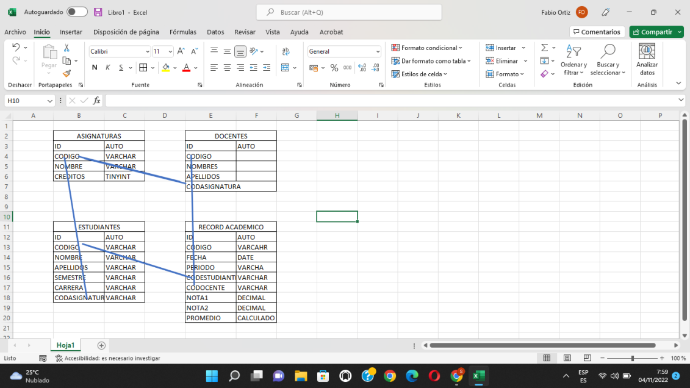

<!doctype html>
<html lang="en">

<head>
    <meta charset="utf-8">
    <meta name="viewport" content="width=device-width, initial-scale=1">
    <title>Bootstrap demo</title>
    <link href="https://cdn.jsdelivr.net/npm/bootstrap@5.2.2/dist/css/bootstrap.min.css" rel="stylesheet"
        integrity="sha384-Zenh87qX5JnK2Jl0vWa8Ck2rdkQ2Bzep5IDxbcnCeuOxjzrPF/et3URy9Bv1WTRi" crossorigin="anonymous">
</head>

<body>

    

        

            <h1>Api Relacional</h1>
            <h4>Estudiantes</h4>
            <h4>Docentes</h4>
            <h4>Asignaturas</h4>
            <h4>Record Academinicos</h4>
        
   
        

            
Proyecto relacional con base de datos Sqlserver y procedimientos almacenados

            

                
            

            
Nelson Andres Montealegre

        
 
    

    
</body>

</html>